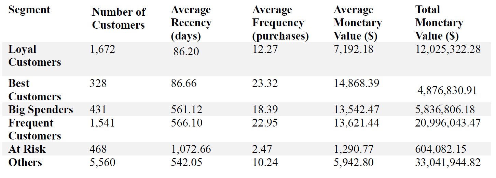
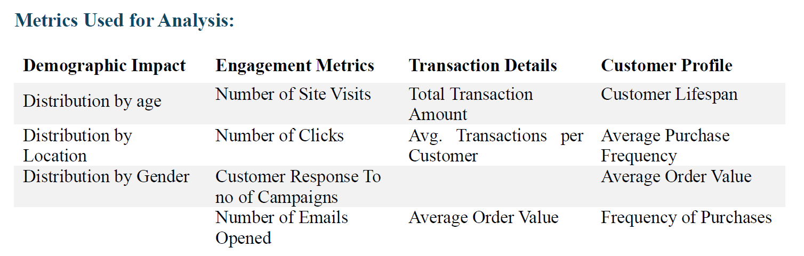

# CLV_Prediction

    
    
    
    
    
    
    

 

# User story
To use machine learning models to predict Customer Lifetime Value (CLV) so that we can enhance customer segmentation and optimize targeted marketing strategies for increased profitability.

# Business Summary

## Executive Summary
A machine learning model was developed and evaluated to predict Customer Lifetime Value (CLV) for EcomX, facilitating targeted marketing by enabling precise customer segmentation. This systematic approach enhances customer engagement, optimize marketing spend and significantly increase the profitability.

## Data Preparation Approach
Multiple datasets (marketing, engagement, customer and transaction) were integrated through feature engineering. This involved aggregating transaction amounts, the number of transactions, and the number of marketing campaigns responded to by customers. Adopted a descriptive analysis approach, addressing low-percentage missing values by filling them with the mode.
Key metrics for calculating Customer Lifetime Value (CLV) were identified: Average Order Value, Average Purchase Frequency, Average Customer Value, and Average Customer Lifespan. These enhancements enable precise customer segmentation and targeted marketing strategies to optimize engagement and revenue.

## Key Insights Informing the Modeling Approach
Statistical tests, RFM Analysis, Linear regression analysis, OLS regression and KNN regression were used to determine the significance of various factors on the target variable.
RFM Analysis and Segmentation:

Based on the results from RFM analysis, it has provided a extensive view of customer segments, enabling targeted marketing strategies and improved customer relationship management. This analysis has identified 6 different customer segments like, Loyal customers, best customers, big spenders, frequent customers, at risk and other customers. Summary statistics for each segment were calculated, providing insights into customer behavior.

## Exploratory Data Analysis:
Based on the results of heatmap, it shows a strong correlation between the monetary value and the frequency (0.92), as well as AvgOrderVal (0.25). The Customer lifespan is also very closely related to emails opened, site visits and clicks (all around 0.75), which shows the important role they play in customer longevity. Other features have weak correlations with monetary value.
Based on the results from the box plot, the Big Spenders and the Best Customers have the highest monitory values. At Risk customers have the lowest monitory value. Across all the segments campaign engagements has remined consistent. The Big spenders and Frequent Customers have the highest transaction frequency and highest site visits. Average order value is also consistent regardless of the customer lifetime. These insights identify key drivers of customer monetary value.

## Model Selection, Performance, and Justification
Customer monetary value is predicted training 3 models by dividing the data into train and test method:
OLS Regression, Linear Regression and K-Nearest Neighbors (KNN) Regression.

## OLS Regression: 
OLS regression model helped us identify the important features that has confirmed the “frequency”, “age” and “AvgOrderVal” as the important predictors. OLS regression model achieved an R-squared of 0.925, with similar performance metrics, reinforcing the dependability of these features in predicting monetary value.

## Linear Regression:
This model has achieved an R-squared of 0.925, with key features including `age`, `frequency`, and `AvgOrderVal`. Performance metrics were MAE of 867.6, MSE of 1,593,056.5, and RMSE of 1,262.2. Residual analysis showed minimal bias and a near-normal distribution, indicating a good fit.

## KNN Regression: 
using standardized features, handled non-linearities and achieved an R-squared of approximately 0.995 with MAE of 179.5, MSE of 89,784.9, and RMSE of 299.6. Cross-validation confirmed its robustness.

Combining these models leverages the interpretability of Linear and OLS Regression and the high accuracy of KNN, which ensures us a comprehensive and reliable approach. The combination of KNN Regression and the Linear Regression offers a balanced approach, by utilising the simplicity and interpretability of Linear Regression and the enhanced performance of KNN, ensuring robust and precise predictions.

## Estimated Impact to the Business
With the Implementation of RFM strategies, revenue is expected to increase 15-20%, Customer retention is expected to increase by 10 -15 % and this implementation will also help improve CLV (customer lifetime value) by 20-25%. The Impacts will include a higher engagement and spending from the loyal, frequent, best and big spenders’ segment. Reactivation campaign for the At-risk clients could see a recovery of 20-30%. Broad marketing may see an increased spending by 5-10%aomg other customers, which will have a significant impact on the performance of the business.

## Conclusion
With the Implementation of the RFM analysis and Machine learning model, it will help EcomX to target its market strategies, improve customer segmentation resulting in a higher customer engagement, increased revenue and improved customer lifetime value. This approach is projected to have a significant impact on overall business performance of EcomX and their profitability.

# license
Please refer to the License in repo

# Contributor:
Alekhya Erikipati ©2024 All Rights Reserved.